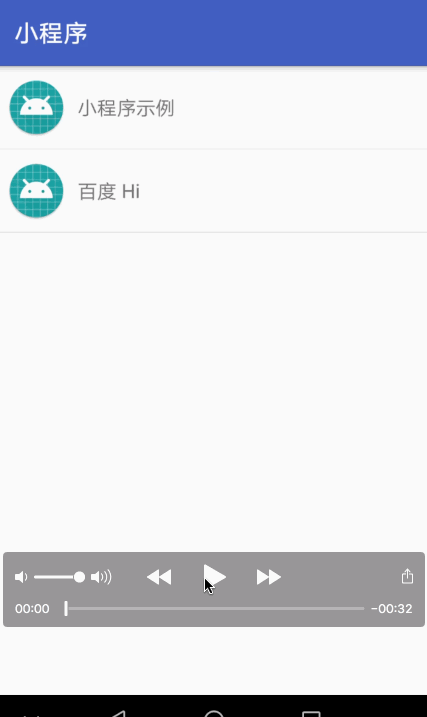

# ReactNative-Plugin-Sample
ReactNative 作为 Android 插件的 Demo

- 下载 npm 依赖

```
yarn install  或者 npm install  
```

- 启动 ReactNative 服务

```
react-native start
```

### 示例


### 打包离线包到 sdcard

自动打包保存到 `/sdcard/bundleAssert/` 下

```
./pack.sh
```

